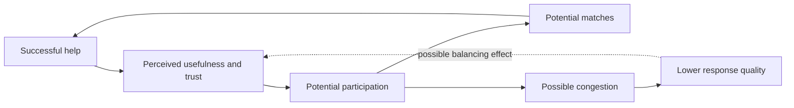

# Chain of Happiness | Product and research overview

The public showcase describes **two connected but distinct activities**: a social-support platform for matching requests to offers, and a System Dynamics research program exploring participation and trust. A product design hypothesis is not a measured causal result.

## Conceptual research feedback

**Scope:** These links are research hypotheses described in the existing [public README](../README.md), not empirically established effects or a disclosed private model diagram. No confidential stock-flow equations or coefficients are included.

## Product versus research evidence

| Publicly described item | Evidence state |
| --- | --- |
| Live product | Public [Chain of Happiness website](https://chainofhappiness.com) is identified in the README; current availability has not been checked for this PR. |
| Request/offer matching and integrity rules | Product design and described platform behavior, not externally audited effectiveness. |
| Participation, matching, trust and congestion loops | Research structure / modeling hypotheses. |
| ISDC 2026 Delft research presentation | Milestone stated in the existing public project description; no new unpublished conference materials reproduced. |

## Screenshot gate

Do not screenshot real users, requests, donations, contact information, moderation tools or unpublished modeling results. A future public image should be a consent-cleared product screen, synthetic account demo, or explicitly labeled conceptual mock-up. **No actual platform screenshot is attached in this PR.**

## Suggested GitHub About fields (not applied)

- **Description:** `Social-impact platform and System Dynamics research on matching needs, resources and participation.`
- **Topics:** `system-dynamics`, `social-impact`, `matching`, `simulation`, `research-showcase`
- **Homepage:** `https://chainofhappiness.com` (check current public availability before setting).

The operational source, personal data and unpublished research remain outside this public repository.