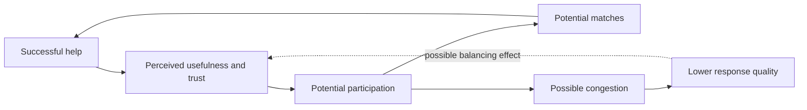
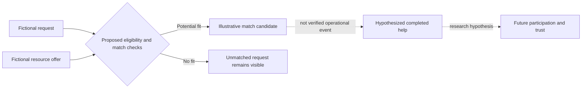

# Chain of Happiness | Product and research overview

The public showcase describes **two connected but distinct activities**: a social-support platform for matching requests to offers, and a System Dynamics research program exploring participation and trust. A product design hypothesis is not a measured causal result.

## Conceptual research feedback

**Scope:** These links are research hypotheses described in the existing [public README](../README.md), not empirically established effects or a disclosed private model diagram. No confidential stock-flow equations or coefficients are included.

## Walkthrough: a fictional request and offer

This is a **text-only illustrative scenario**, not a screenshot, a real transaction, or a claim that all steps are implemented in the deployed platform.

1. A fictional community member creates a request for two hours of tutoring. No name, address, contact detail or real user information is used in this example.
2. Another fictional member offers a tutoring session. The request and offer are *separate* objects: posting an offer is not proof that a match occurred.
3. A proposed matching workflow checks skill, availability and permitted roles. A self-funding or self-matching safeguard is a **design requirement**, not an independently verified deployed control.
4. An illustrative completed-help event could motivate the *research hypothesis* that perceived usefulness influences later participation. It is **not** a measured effect, confirmed causal loop or platform outcome.

## Publicly supported status distinctions

| Item | Appropriate public statement |
| --- | --- |
| Website | A public platform URL is documented; current availability and specific flows were not independently tested in this review. |
| Requests, offers, integrity and matching | Described product design and functionality, with **no new deployment verification** from this document. |
| Feedback, trust and congestion | Conceptual research hypotheses; do not label them validated causal effects. |
| ISDC 2026 | Presentation milestone stated in the [README](../README.md); no unpublished abstract, paper or model parameters reproduced. |

## A future genuine screenshot

No actual platform image is included. A reviewable capture must use consent-cleared public material or a **clearly marked synthetic account**, never genuine requests, donations, moderation details or contact information. Capture and label only a flow actually verified in the deployed version; do not depict this hypothetical walkthrough as implemented behavior.

## GitHub About fields — proposed, not applied

- **Description:** `Social-impact platform and System Dynamics research on matching needs, resources and participation.`
- **Topics:** `system-dynamics`, `social-impact`, `matching`, `simulation`, `research-showcase`
- **Homepage:** `https://chainofhappiness.com` (check public availability before setting).

Operational source, personal data and unpublished research stay outside this public repository.